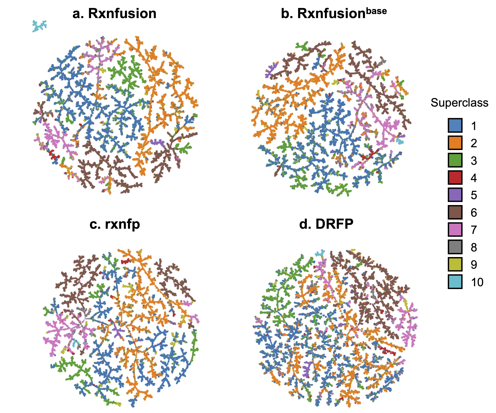

# Rxnfusion

Rxnfusion is a reaction representation model for organic synthesis and enzyme catalysis. This repository provides streamlined inference code for generating reaction embeddings, creating TMAP visualizations, and running prediction tasks for organic reactions and `kcat` prediction.


*Figure 1: Overview of the Rxnfusion framework.*

## Features

1. Generate a 2304-dimensional `[CLS] + mean pooling` concatenated representation for any reaction SMILES
2. Create a TMAP of large-scale reaction space using Rxnfusion embeddings
3. Run Schneider 50K and TPL reaction classification
4. Run DDBH, Suzuki, USPTO above, and USPTO below reaction yield prediction
5. Run warm, cold reaction, and cold enzyme `kcat` prediction

## Directory structure

```text
assets/       Vocabulary and runtime outputs
ckpt/         Downloaded and extracted model checkpoints
connfigs/     Inference configurations; the original directory spelling is retained
dataset/      Built-in TMAP example data; downstream task data are extracted from the data archive
rxnfusion/    Model, tokenizer, and inference code
figure1.png   Main Rxnfusion figure
figure3.png   TMAP result figure
```

Large files in `ckpt/`, `dataset/`, `assets/results/`, and `assets/tmap/` should not be committed to GitHub.

## Downloads

Three files are available from Google Drive:

| File | Download link | Purpose |
| --- | --- | --- |
| `rxnfusion_ckpt.tar.gz` | [Google Drive](https://drive.google.com/file/d/1xfs2ZQ5XGVuwz9Mf228YjYt2UVsoSOgu/view?usp=drive_link) | The optimal single-fold checkpoint for each downstream task and the pretrained embedding checkpoint |
| `rxnfusion_dataset.tar.gz` | [Google Drive](https://drive.google.com/file/d/1GG3o-cggck5WlsNqT-so7I8P3KX3U_a2/view?usp=drive_link) | Test sets for all downstream tasks |
| `model.ckpt` | [Google Drive](https://drive.google.com/file/d/1O5ZzXdqUHiW1Q9lJRNiNqLjCErPNSpaB/view?usp=drive_link) | Standalone download for embedding generation or TMAP visualization only |

Files can be downloaded through a browser or from the command line after installing `gdown`:

```bash
python -m pip install gdown
```

### Using only the pretrained model

We recommend using the pretrained model to adapt Rxnfusion to your dataset.

If you only need to generate reaction embeddings or create a TMAP, you do not need to download the approximately 62 GiB complete checkpoint archive. Download only the standalone pretrained model:

```bash
mkdir -p ckpt/embedding
gdown --fuzzy "https://drive.google.com/file/d/1O5ZzXdqUHiW1Q9lJRNiNqLjCErPNSpaB/view?usp=drive_link" -O ckpt/embedding/model.ckpt
```

The repository directly provides `dataset/uspto50k.csv`, so the complete data archive is not required to create the example TMAP. To create a TMAP with other data, the input CSV must contain `reaction` and `class` columns.

### Using all features

Run the following commands from the repository root:

```bash
gdown --fuzzy "https://drive.google.com/file/d/1xfs2ZQ5XGVuwz9Mf228YjYt2UVsoSOgu/view?usp=drive_link" -O rxnfusion_ckpt.tar.gz
gdown --fuzzy "https://drive.google.com/file/d/1GG3o-cggck5WlsNqT-so7I8P3KX3U_a2/view?usp=drive_link" -O rxnfusion_dataset.tar.gz

tar --no-same-owner -xzf rxnfusion_ckpt.tar.gz
tar --no-same-owner -xzf rxnfusion_dataset.tar.gz
```

Extraction creates the `ckpt/` and `dataset/` directories directly.

## Installation

Enter the repository and create an environment named `rxnfusion`:

```bash
cd /path/to/Rxnfusion
mamba env create -f environment.yml
mamba activate rxnfusion
```

`environment.yml` installs Python 3.11, CUDA-enabled PyTorch, TMAP, Annoy, and Faerun, and automatically runs:

```bash
pip install -e .
```

Full model inference requires an NVIDIA GPU with sufficient memory.

## Reaction embedding

Generate a 2304-dimensional representation for a single reaction SMILES:

```bash
mkdir -p assets/results

python -m rxnfusion.embedding \
  --checkpoint ckpt/embedding/model.ckpt \
  --reaction 'CCO>>CC=O' \
  --output assets/results/embedding.jsonl
```

The following batch input formats are supported:

- `--input-file`: one reaction per line
- `--input-csv --csv-column reaction`: read a specified CSV column
- Use `.jsonl`, `.npy`, or `.pt` as the output file extension

## TMAP

The built-in `dataset/uspto50k.csv` can be used directly for the example. A custom CSV must contain at least a `reaction` column and a `class` column for coloring.

```bash
python -m rxnfusion.tmap \
  --input dataset/uspto50k.csv \
  --checkpoint ckpt/embedding/model.ckpt \
  --output-dir assets/tmap/uspto50k
```

The original shell entry point is also available:

```bash
bash rxnfusion/tmap/run_uspto50k_rxnlm_tmap.sh
```



*Figure 3: TMAP visualization of Rxnfusion reaction representations.*

## Downstream task inference

Because the complete five-fold checkpoints are large, this repository provides only the optimal single-fold checkpoint for each downstream task to reduce download, transfer, and storage costs. This is the fold with the highest primary metric among the existing five-fold results, rather than the complete set of five-fold checkpoints. Classification tasks were selected by accuracy, and regression tasks were selected by `R²`. These optimal single-fold checkpoints are intended for streamlined inference; all five folds should still be used to report five-fold means in the paper.


### Organic reaction tasks

The following example runs Suzuki reaction yield prediction:

```bash
python -m rxnfusion.five_fold \
  --config connfigs/reaction_suzuki_regression.yaml \
  --checkpoint-root ckpt \
  --dataset-root dataset \
  --output-root assets/results \
  --folds 3
```

To run another task, replace both the configuration file and the `--folds` value according to the table. Do not omit `--folds`, because the script searches for all five fold checkpoints by default.

### BioReact kcat prediction

The following example runs the warm setting:

```bash
python -m rxnfusion.five_fold \
  --config connfigs/kcat_warm.yaml \
  --checkpoint-root ckpt \
  --dataset-root dataset \
  --output-root assets/results \
  --folds 4
```

BioReact CSV files use the `split`, `sequence`, `reaction`, and `log10kcat_max` columns. The script evaluates only samples with `split=test`.

## Outputs

Downstream task results are written to:

```text
assets/results/<task>/fold_<n>/predictions.csv
assets/results/<task>/fold_<n>/metrics.json
assets/results/<task>/summary.json
```

The files contain:

- `predictions.csv`: per-sample predictions
- `metrics.json`: evaluation metrics for the current fold
- `summary.json`: summary results for the folds run in the current command

TMAP results are written to the directory specified by `--output-dir`.

## Troubleshooting

### Checkpoint not found

Confirm that `--folds` matches the table above and that the file is located at:

```text
ckpt/<task>/fold_<n>/model.ckpt
```

### Test set not found

Test sets for organic reaction tasks are located at:

```text
dataset/<task>/5_fold/<n>_fold/test.csv
```

BioReact test sets are located at:

```text
dataset/<task>/fold_<n>.csv
```

## Citation

If this project is useful for your research, please cite:

```bibtex
@article{liu_rxnfusion,
  title   = {Rxnfusion: Learning reaction representations for organic synthesis and enzyme catalysis},
  author  = {Liu, Tiantao and Zhai, Silong and Zhan, Xinke and Deng, Junwen and Chen, Kepeng and Siu, Shirley W. I.},
  journal = {},
  year    = {}
}
```
